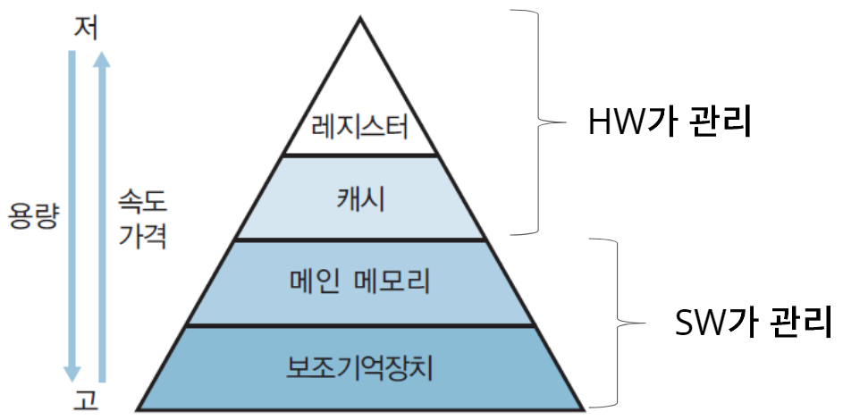

# Memory Management

## 1. 메모리(Memory)

> CPU가 프로세스를 실행할때 필요한 주소와 같은 정보들을 저장하고 사용할 수 있는 공간. 통상적으로 메인 메모리를 뜻하긴하나 메모리를 계층 구조로 분류하곤 한다.

  

<ul>
  <li>위와 같은 계층에서 상위 계층일수록 메모리의 용량은 줄어들고 가격은 높아지지만 접근 속도가 비약적으로 상승한다.</li>
  <li>내부 기억장치는 CPU와 같은 HW 기계장치가 직접 접근할 수 있다.</li>
  <li>외부 기억장치는 직접 접근이 불가능하기에 주기억장치에 적재 후 사용된다.</li>
</ul>

### ✓ 메모리 관리는 왜 필요할까?

> 모든 프로세스는 실행을 위한 메모리 공간이 필요한데, 이때 한정된 자원인 메모리를 효율적으로 사용하기 위해서 운영체제가 메모리를 관리한다.
> 각각의 프로세스는 접근이 혀용된 메모리 공간외에 접근이 불가능하기에 모든 메모리 공간에 접근이 가능한 운영체제가 메모리를 관리하는 것이다.
> 적절히 할당하고 제거하는 관리행위를 메모리 관리라고하고, 한정된 자원을 효율적으로 사용하기 위해 메모리 관리가 필요한 것이다.

## 2. 주소 바인딩(Address Binding)
우선, 프로세스의 주소(Address)는 논리적 주소(Logical address)와 물리적 주소(Physical address)로 분류할 수 있다.
<ul>
  <li><b>논리적 주소: </b>가상 주소라고도 불리는 CPU가 생성하는 주소로, 각각의 프로세스가 독립적으로 가지는 주소공간이다.</li>
  <li><b>물리적 주소: </b>프로세스의 실행을 위해 필요한 정보들이 실제 메모리에 위치한 공간의 주솟값을 의미한다.</li>
</ul>

주소 바인딩(Address Binding)은 어떤 프로세스가 어떤 물리적 주소위에 위치할지를 결정하는 과정을 뜻한다.
바인딩 되는 시점에 따라 다음과 같이 분류된다
<ul>
  <li>Compile Time</li>
  <li>Load Time</li>
  <li>Execution(Run) Time</li>
</ul>

### 2.1 Compile Time Binding

프로세스의 물리적 주소가 컴파일 때 지정된다는 뜻으로, 프로세스가 적재될 위치를 미리 인지하고 있다면 컴파일러는 해당 주소를 고정 주소(절대 주소)로 생성하여 실행파일에 포함시킨다.
그렇기에 만약 물리적 주소가 변경된다면 컴파일을 다시 하여 새로운 주소를 지정해주어야 한다. 컴파일 타임 주소 할당은 프로세스 내부에서 사용하는 논리적 주소와 물리적 주소가 동일하다는 특징을 가진다. 
> Compile Time Binding 방식의 단점은 적재될 주소가 고정되어 있기에 혹여나 해당 주소공간에 이미 다른 프로세스가 메모리 공간을 차지하고 있을 경우 충돌이 발생할 수 있다는 것이다.
 
### 2.2 Load Time Binding

프로세스가 적재될 위치를 미리 인지할 수 없다면 컴파일러는 이때 Relocatable code를 생성하여 어느 메모리 공간에 적재되더라도 수행이 가능하게끔 하도록 해야햔다.
Load Time Binding 방식은 수행 프로세스 구동 시에 물리적 주소가 결정되는 방식으로 Loader가 해당 프로세스를 메모리에 로드 하는 프로세스의 물리적 주소가 결정된다.
그리고 Loader가 프로세스를 메모리에 load 하는 시점에 물리적 주소를 결정한다. 
따라서 로드 타임 주소 할당은 논리적 주소와 물리적 주소가 다르다.

> 하지만, 프로세스 내에 메모리를 참조하는 명령어들이 많아서 이들의 주소를 다 바꿔줘야 하기 때문에, 로딩할 때의 시간이 매우 커질 수 있다는 단점이 있다. 따라서 컴파일 타임과 로드 타임 주소 할당은 실제로 잘 쓰이지 않는다. 

### 2.3 Execution Time Binding
