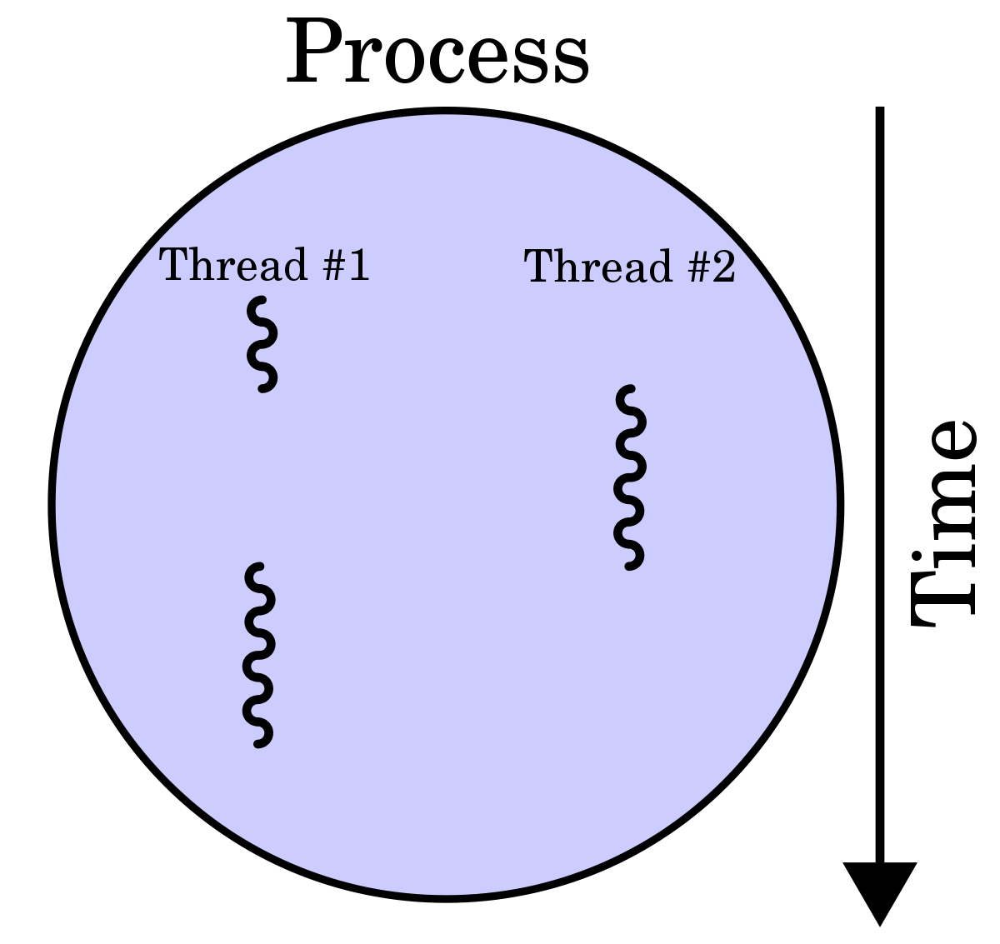
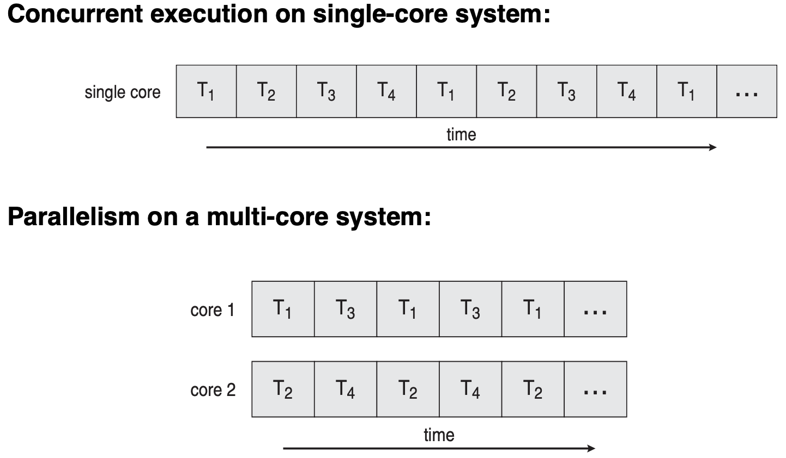

# Thread

## 1. 스레드(Thread)

> 스레드는 하나의 프로세스 안에서 실행되는 흐름의 단위를 말한다. 
> 일반적으로 한 프로세스는 하나의 스레드(싱글스레드)를 가지고 있지만, 프로그램 환경에 따라 둘 이상의 멀티스레드를 구현하여 동작할 수 있다.

### 1.1 멀티스레드(Multi Thread)

    

> 멀티스레드는 하나의 프로세스에 둘 이상의 스레드가 동시에 작업을 수행하는 경우를 의미한다. 
> 멀티스레드는 각 스레드가 자신이 속한 프로세스의 메모리를 공유하며, Data 영역을 공유하기에 전역변수를 통해서 각 스레드가 동시에 접근하고자 하는 값에 접근할 수 있게 된다.

### 1.2 동시성과 병렬성(Concurrent & Parallelism)

    

> 멀티스레드와 같이 하나의 프로세스에 여러 개의 스레드가 존재하는 이유는 이들이 빠른 시간 간격으로 스위칭되기 때문엔데, 이때 User는 여러 개의 스레드가 동시에 실행되는 것처럼 느끼게 된다.
<ul> 
  <li><b>동시성(Concurrent)</b>: 싱글 코어에서 여러개의 스레드가 스위칭으로 인해 동시에 수행되는 것처럼 보이는 것을 의미한다.</li>
  <li><b>병렬성(Parallelism)</b>: 멀티 코어에서 멀티 스레드를 동작시키는 방식으로, 여러 스레드가 실제로 동시에 수행되는 것을 의미한다. 병렬성은 데이터 병렬성, 작업 병렬성으로 구분된다.</li>
</ul>

